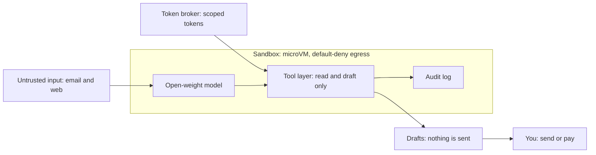

```mermaid
flowchart LR
  U[Untrusted input: email and web] --> M
  B[Token broker: scoped tokens] --> T
  subgraph S[Sandbox: microVM, default-deny egress]
    M[Open-weight model] --> T[Tool layer: read and draft only]
    T --> A[Audit log]
  end
  T --> D[Drafts: nothing is sent]
  D --> Y[You: send or pay]
```
