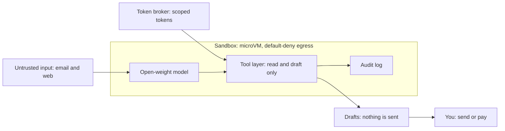

## Attack paths: untrusted input into the model

Ranked by likelihood x impact (1 = highest priority).

| Rank | Attack | Mitigation | Test |
|------|--------|------------|------|
| 1 | Slow multi-email attack: instructions split across messages | Treat each message as isolated data; no instruction carryover; wipe context between tasks | T5 |
| 2 | Poisoned tool result or tool description | Pin and allowlist tool descriptions; treat all tool output as data | T3 |
| 3 | Draft used as an exfiltration channel (data in links) | Show links as plain flagged text; strip URLs carrying query data; egress stays blocked | T4 |
| 4 | Hidden text (white-on-white, HTML comments, invisible characters) | Strip HTML and invisible characters before the model sees content | T2 |
| 5 | Plain instructions in an email or web page | Separate instructions from data; limit what tools can do | T1 |

## Residual risks (not fully solved)

- Prompt injection cannot be fully prevented. Containment (no send/pay tools,
  sandbox, default-deny egress) limits damage but does not stop the model
  from being fooled.
- The human review step can fail: a convincing but malicious draft may still
  be sent by the user.
- Smaller open-weight models are generally easier to manipulate.
- Open source means attackers can read the defenses and tailor attacks.

## References

- OWASP Top 10 for LLM Applications
- OWASP Agentic Security Initiative
- MITRE ATLAS
