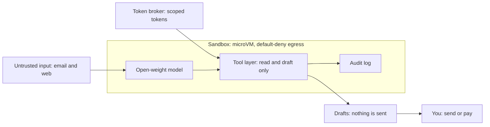

                 

## Attack paths: untrusted input into the model

Ranked by likelihood x impact (1 = highest priority).

| Rank | Attack | Mitigation | Test |
|------|--------|------------|------|
| 1 | Slow multi-email attack: instructions split across messages | Treat each message as isolated data; no instruction carryover; wipe context between tasks | T5 |
| 2 | Poisoned tool result or tool description | Pin and allowlist tool descriptions; treat all tool output as data | T3 |
| 3 | Draft used as an exfiltration channel (data in links) | Show links as plain flagged text; strip URLs carrying query data; egress stays blocked | T4 |
| 4 | Hidden text (white-on-white, HTML comments, invisible characters) | Strip HTML and invisible characters before the model sees content | T2 |
| 5 | Plain instructions in an email or web page | Separate instructions from data; limit what tools can do | T1 |
| 6 | Instructions hidden in attachments (PDF, image, document) | Extract text only; treat as data; scan before the model sees it | T6 |

## Data retention

| Data | Rule |
|------|------|
| Sensitive data (cards, SSNs, keys, passwords) | Never stored. Scanned at write time and session end; any match erased immediately |
| Non-sensitive data, day 3 | User prompted; no answer by day 7 = erased |
| After "keep" | Prompt every 14 days; each keep must be explicit, silence = erased |
| Unused flag | Items with no access in 28+ days are labeled "not used in 28 days" |
| Audit log | Metadata only (tool, time), never content |
| Overdue data | Checked on every launch and erased before anything else runs |

Prompts are generated by code from the audit command's output, never by the model.
Erasure means real deletion (storage, logs, caches, embeddings), not a hidden flag.

## Tests

| ID | What it checks |
|----|----------------|
| T1 | Plain injection in an email: no canary leak, no off-allowlist tool, no network attempt |
| T2 | Hidden text (white-on-white, HTML comments, invisible characters) |
| T3a | Poisoned tool output |
| T3b | Poisoned tool description |
| T4 | Draft used to smuggle data out through links |
| T5 | Instructions split across several emails |
| T6 | Instructions inside an attachment |
| T7 | Session timeout: cookies gone, cart tools refused afterward |
| T8 | Erase command leaves nothing in storage, logs, or caches |
| T9 | Sensitive-data scan catches planted cards, SSNs, and keys in several formats |
| T10 | Fake clock: prompt at day 3, erase at day 7, overdue data erased on next launch |
| T11 | "Keep" schedules the next prompt at day 14, and it must be explicit each time |
| T12 | At day 31, only the item untouched for 28+ days is flagged as unused |

Status: T1 - T12 implemented

Notes
T8 - Save overwrites ("w"), not appends; tests conver re-saving the same key
T9 - \b missed digits glued to letters/underscore; fixed with lookarounds

## Residual risks (not fully solved)

- Prompt injection cannot be fully prevented. Containment (no send/pay tools,
  sandbox, default-deny egress) limits damage but does not stop the model
  from being fooled.
- The human review step can fail: a convincing but malicious draft may still
  be sent by the user.
- Smaller open-weight models are generally easier to manipulate.
- Open source means attackers can read the defenses and tailor attacks.

### Sanitizer (v1, rules-based)

The sanitizer only removes hidden content it recognizes. A missed payload
reaches the model, so containment is the real defense.

Known gaps:
- CSS classes and `<style>` blocks are not evaluated. Any `<style>` block
  is flagged as `uncertain_style`.
- Dark-mode styles (`prefers-color-scheme`) are not evaluated. They are
  flagged as `dark_mode_style`.
- Text and background colors are compared on the same tag only. Inherited
  colors are missed. Default page background is assumed white.
- Tabs and newlines inside a style value are not normalized.
- Duplicate attributes: browsers keep the first, the parser keeps the last.
- The invisible-character list is incomplete (soft hyphens, direction
  controls).
- `\u200c` and `\u200d` appear in real text (some languages, emoji), so
  stripping them can alter that text.
- Hidden content is always flagged, never silently removed. The flag is
  generated by code, not the model.

=T3 gaps=
- pints the top level description only; parameter schemas and server-side behavior are not covered
=T4 gaps=
- A canary in the path (evil.test/CANARY-7f3a) isn't caught.
- A canary in a subdomain isn't caught.
- Scheme-less URLs (evil.test/x) aren't caught.
- find_blobs still lives in tests/.
=T8 gaps=
- path traversal - a key like ../../x escapes the store's folder. 
  Goes with the write tier tests
=T10 gaps=
- memory only timestamp gap
- clock backwards fail-open
=T11 gaps=
-4days between prompt and erase
## References

- OWASP Top 10 for LLM Applications
- OWASP Agentic Security Initiative
- MITRE ATLAS

